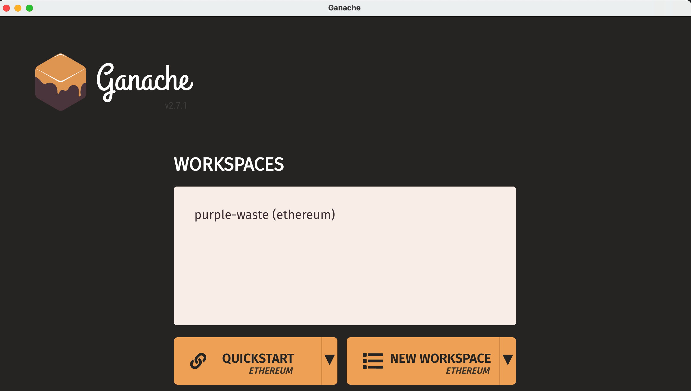
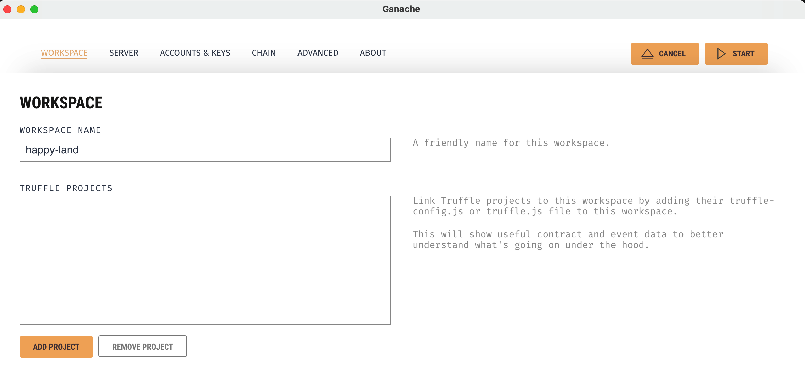
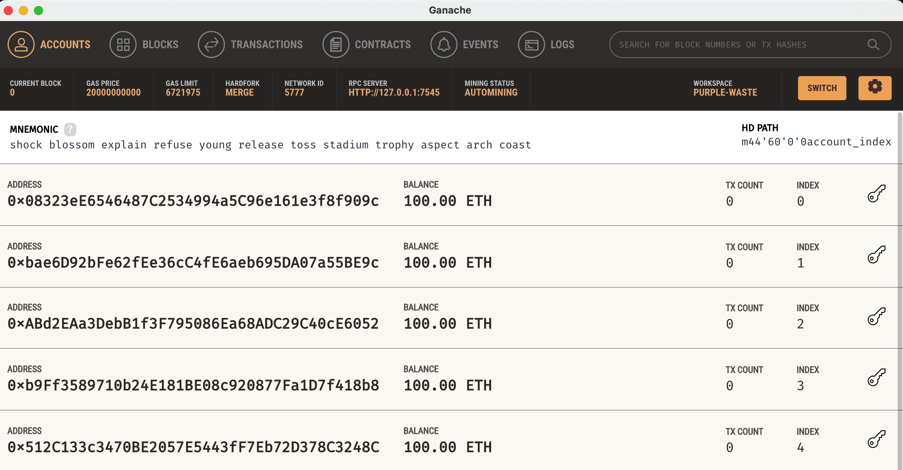

## Setting up Ganache

### Prerequisites
1. Node.js (v12 or later recommended)
    - Download from nodejs.org
    - Verify: `node --version`
2. npm (comes with Node.js)
    - Verify: `npm --version`
3. Ganache desktop app (already installed based on your screenshot)
    - If not installed yet: download from trufflesuite.com/ganache
4. Optional but common — Truffle or Hardhat (smart contract frameworks)
    `npm install -g truffle`
    or
    `npm install --save-dev hardhat`

### Running Ganache
1. Open Ganache.  

2. Click NEW WORKSPACE.  

3. Under "Add Project", browse to and select: /Users/zaw/MyFiles/Yoobee/804-PrjStudy/Decentralized-Voting-System/truffle-config.js.     

4. Click Start or Save Workspace.   
Then you can see local Ethereum blockchain running as follows.   

**Note**
This is local Ethereum blockchain for development and testing. It can also be referred as:
- Local blockchain (most common)
- Local testnet
- Development network / dev network
- Specifically: Ganache blockchain

For testing on real public network sharing with others (no real money at risk), Sepolia / Goerli can be used.
For production launch, it is Ethereum Mainnet.

The final screenshot gives these information.
| Field | Value | Meaning |
|-----|-----|-----|
| RPC SERVER | HTTP://127.0.0.1:7545 | The local address your app connects to |
| NETWORK ID | 5777 | Identifies this as your local network |
| MINING STATUS | AUTOMINING | Instantly mines blocks when transactions happen |
| CURRENT BLOCK | 0 | No transactions yet |
| MNEMONIC | 12 words shown | Seed phrase that generates all test accounts |
| BALANCE | 100.00 ETH each | Fake ETH for testing — not real money |
