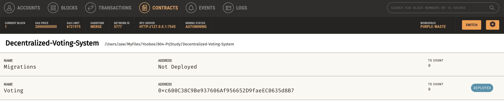
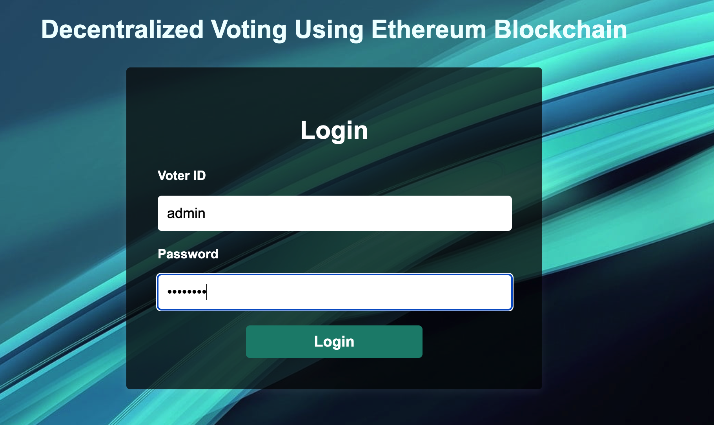
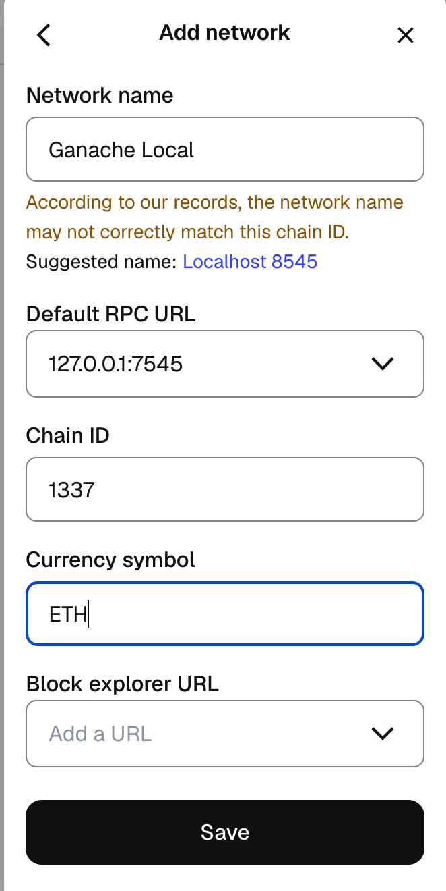
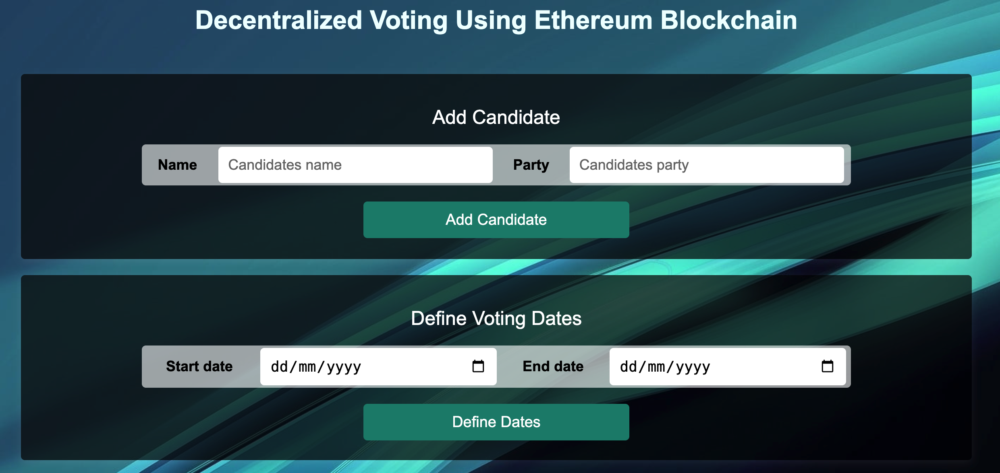

## Actvities
1. Resolving the issues of credentials in .env file 
    1.1 Stop tracking .env files 
    1.2 Remove the .env files from git
    1.3 .env.sample file is created to inform what are the required environment variables
---

2. Environment setup
    2.1 Create environment with Python 3.11:  `conda create -n env-bc python=3.11 -y`
    2.2 Activate the environment: `conda activate env-bc`
    2.3 Install the required libraries: `pip install fastapi mysql-connector-python pydantic  python-dotenv  "uvicorn[standard]" PyJWT`
---

3. Database setup
    3.1 MySQL is set up in Docker using __Database_API/docker-compose.yml__ and __init.sql__.
    3.2 When the container is up and running, check if the DB can be connected.No
---

4. Compile & deploy contracts
    4.1 In __Decentralized-Voting-System__, run `truffle compile` and `truffle migrate`
    4.2 Check and make sure the contract is deployed in Ganache as shown below:
    
---

5.  Bundle the frontend and run
    5.1 In __Decentralized-Voting-System__, `npx browserify ./src/js/app.js -o ./src/dist/app.bundle.js`
    5.2 In __Decentralized-Voting-System__, `npx browserify ./src/js/login.js -o ./src/dist/login.bundle.js`
    5.3 In one terminal, run the Express server: `node index.js` 
    5.4 In another terminal, in env-bc, run the web server: `uvicorn main:app --reload --host 127.0.0.1`
    5.5 Then http://localhost:8080/ should give the login page as follows:
    
---

To be able to login, there is one final step to do.

6. MetaMask Setup
    6.1 Open MetaMask extension in Chrome. Login using Google, and do the basic setups as per prompts.
    6.2 Then "Add Wallet", "Import an account" and use the private key from one of the Ganache accounts (at the end of the row, there is a key icon to click and copy the private key to import)
    6.3 Add custom network for the added account with the settings below.
    
    6.4 If the saved network is not listed, go to "Networks" menu of Meta mask and check "Show Test Network". Then for the imported account, use that custom network.
    6.5 Then user should be able to log in as follows:
    

